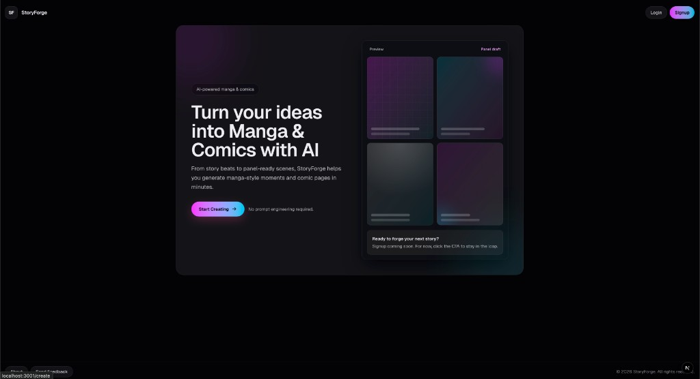
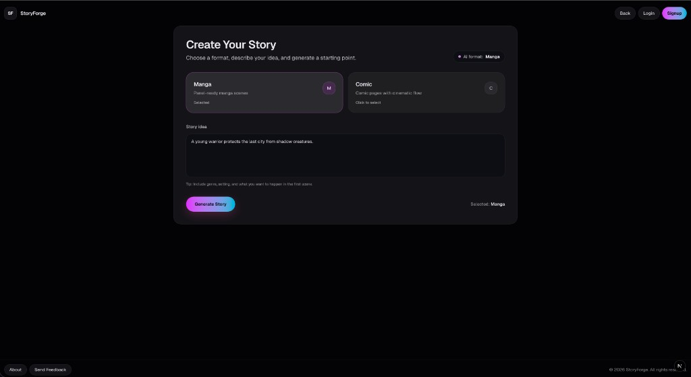
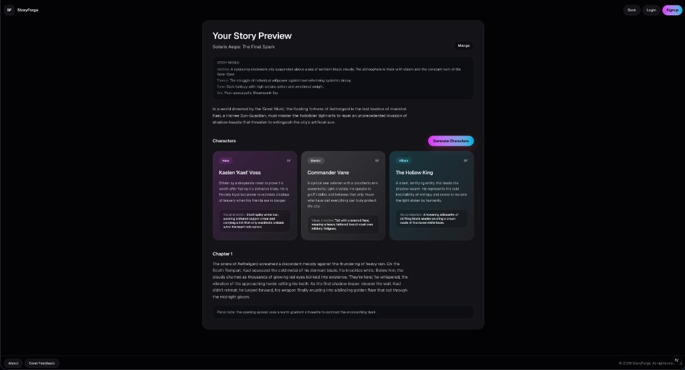
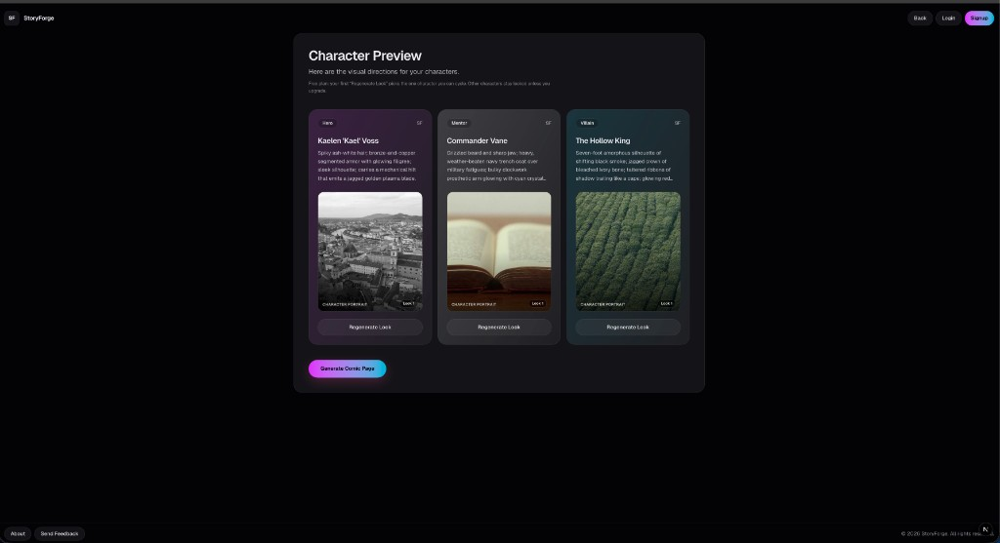
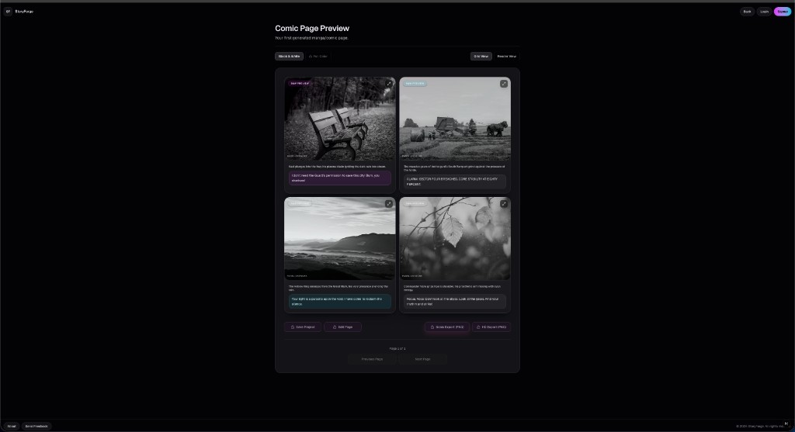
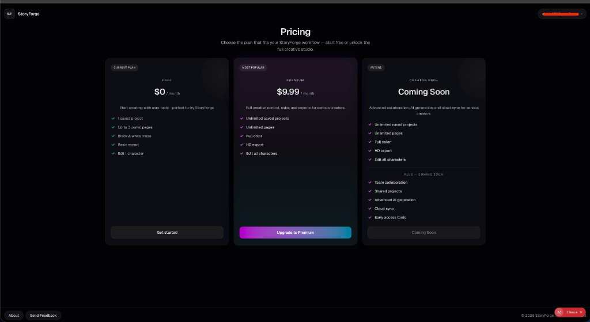
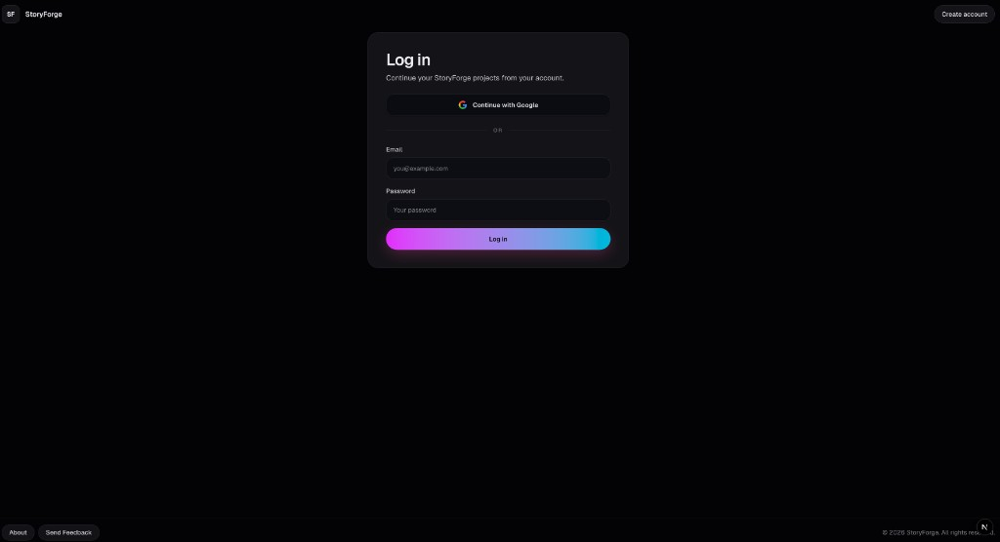
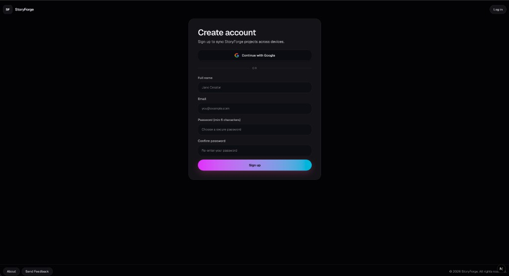
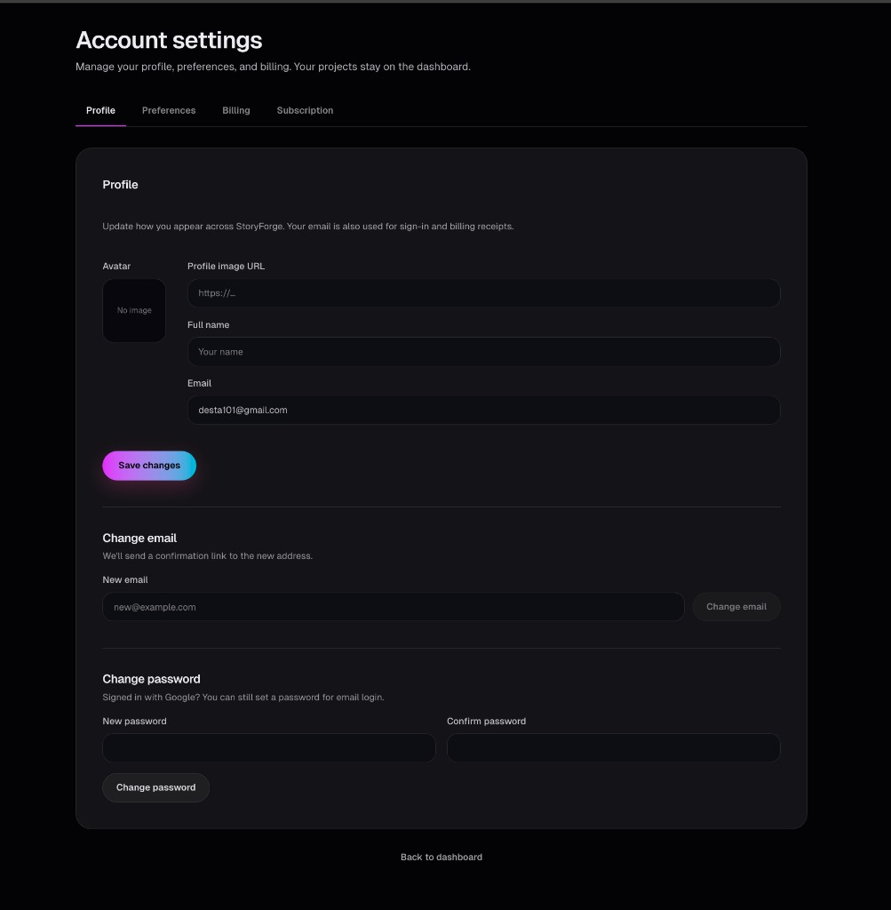

# StoryForge

StoryForge is a Next.js app for generating and editing manga/comic story drafts with AI.
It supports end-to-end story creation, character generation, comic panel generation, project save/load, auth, plan gating, and Stripe upgrade flows.

## Core Features

- Create a story from an idea (`manga` or `comic`)
- Story preview with retry and mock fallback states
- Character generation and character preview
- Comic panel generation with panel-level image prompts
- AI image flow for portraits and panels with fallback placeholders
- Local + cloud project persistence (Supabase)
- Auth flows (`signup`, `login`, OAuth callback)
- Plan-aware gating (`free` vs `premium`)
- Stripe checkout + billing portal integration

## Tech Stack

- Next.js 16 (App Router)
- TypeScript
- Supabase (Auth + DB)
- Google Gemini (text + image generation)
- Stripe (billing)

## Project Structure

```text
app/
  api/                      # Server routes
  create/                   # Story creation UI
  story-preview/            # Story preview UI
  character-preview/        # Character preview UI
  comic-preview/            # Comic preview UI
  project/[id]/             # Saved project editor
  dashboard/                # Project listing
  lib/
    image-engine/           # Internal reusable image engine architecture
    storyDraft.ts           # Core StoryDraft types/parsing/helpers
    geminiImage.ts          # Gemini image API integration
    geminiQuota.ts          # Quota/rate-limit classification + cooldown metadata
supabase/                   # SQL and migration files
```

## Environment Variables

Copy `.env.example` to `.env.local` and fill values:

- `GEMINI_API_KEY`
- `GEMINI_MODEL`
- `GEMINI_IMAGE_MODEL`
- `NEXT_PUBLIC_SUPABASE_URL`
- `NEXT_PUBLIC_SUPABASE_ANON_KEY`
- `SUPABASE_SERVICE_ROLE_KEY`
- `NEXT_PUBLIC_APP_URL`
- `STRIPE_SECRET_KEY`
- `STRIPE_WEBHOOK_SECRET`
- `STRIPE_PREMIUM_MONTHLY_PRICE_ID`

Important:
- Never commit `.env.local`
- Only commit `.env.example` with placeholder values

## Local Development

Install dependencies:

```bash
npm install
```

Run development server:

```bash
npm run dev
```

Build production bundle:

```bash
npm run build
```

## Main Routes

Pages:

- `/`
- `/create`
- `/story-preview`
- `/character-preview`
- `/comic-preview`
- `/dashboard`
- `/project/[id]`
- `/pricing`
- `/login`
- `/signup`
- `/account-settings`

API:

- `POST /api/generate-story`
- `POST /api/generate-characters`
- `POST /api/generate-comic-panels`
- `POST /api/refresh-story-draft`
- `GET/POST /api/projects`
- `GET/PATCH/DELETE /api/projects/[id]`
- `GET /api/me/plan`
- `POST /api/stripe/checkout`
- `POST /api/stripe/portal`
- `POST /api/stripe/webhook`

## Notes

- Gemini quota/timeouts gracefully fallback to mock mode in supported flows.
- UI keeps existing preview flow: Create -> Story Preview -> Character Preview -> Comic Preview.
- Image requests use the internal `app/lib/image-engine` module for prompt and provider abstraction.

## Screenshots

### Home


### Create Story


### Story Preview


### Character Preview


### Comic Preview


### Pricing


### Login


### Signup


### Account Settings

